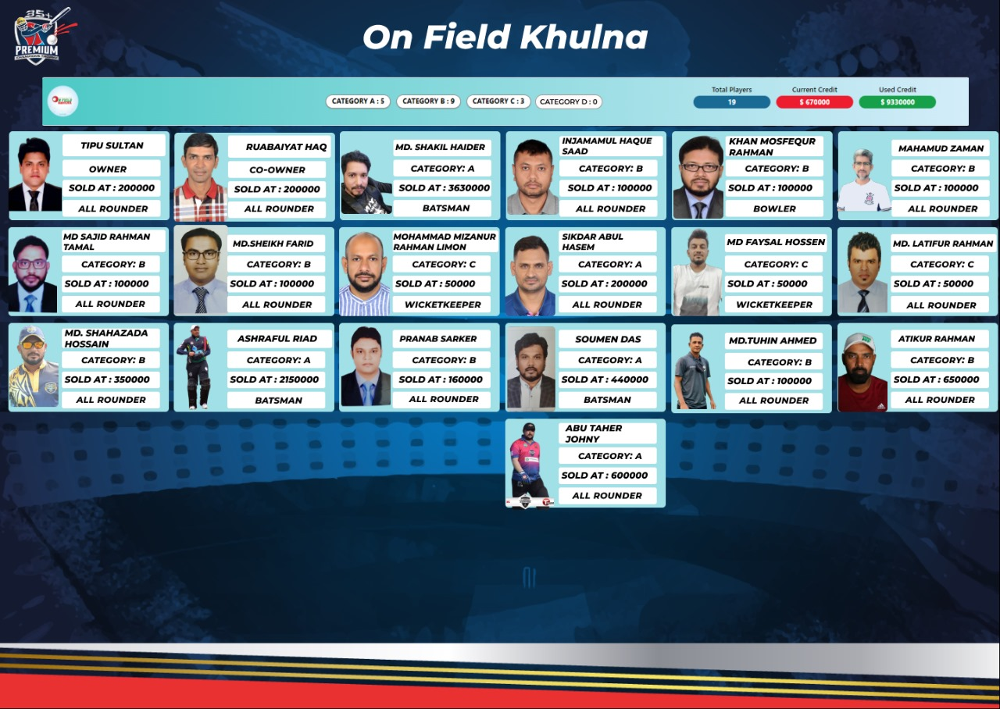
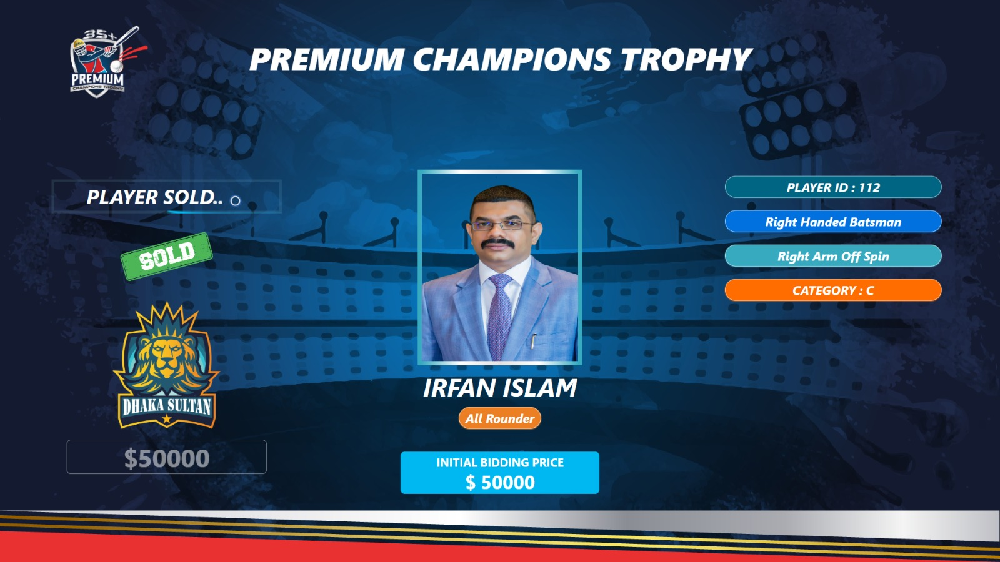
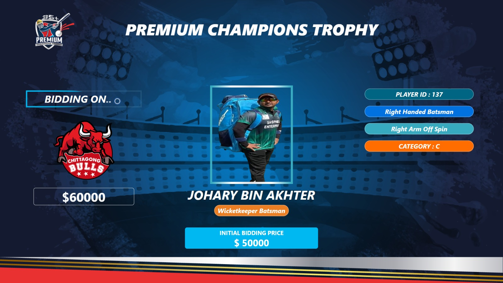
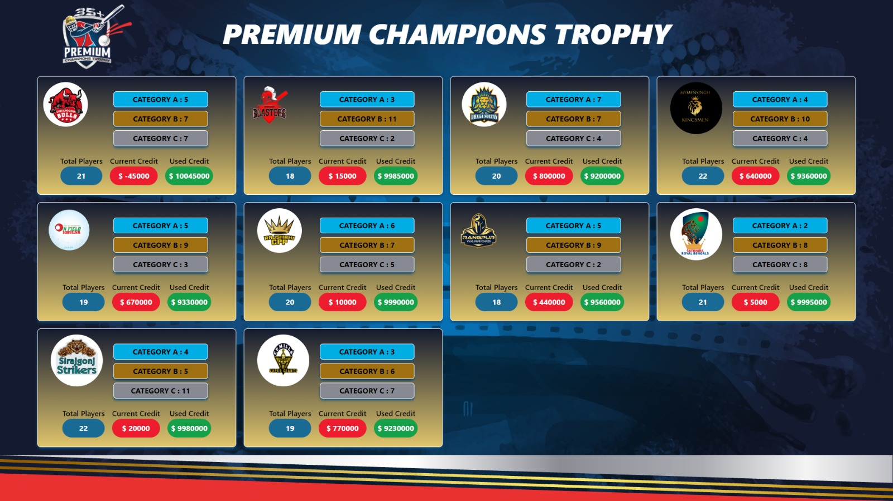

<h1>Features</h1>

<h2>Live Bidding System</h2>
<h3>Real-Time Bidding</h3> Experience the thrill of live auctions with our real-time bidding feature, designed for quick and responsive interactions.
<h3>Dynamic Auction Environment</h3> Engage in a lively auction atmosphere, perfectly suited for the high-energy world of sports.

<h2>Player Management</h2>
<h3>Player Registration </h3>Easy-to-use interface for adding players to the auction pool, with detailed profile creation.
<h3>Player Profiles</h3> Comprehensive player profiles, offering insights into each player's history, skills, and statistics.

<h2>Post-Auction Analysis</h2>
<h3>Team Overview</h3> Post-auction, easily view the composition of each team, including detailed player lists.
<h3>Account Management</h3> Track and manage player accounts, offering a clear view of team finances and player status.
<h3>Unsold Player Listing</h3> Quickly access a list of players who weren't sold during the auction, available for future considerations.

<h2>Team Organization</h2>
<h3>Excel Generation</h3> Effortlessly generate team sheets in Excel format, allowing for easy data management and sharing.
<h3>Team Roster Management</h3>Organize and view team rosters in a user-friendly format, aiding in strategic planning and team composition.

<h2>Performance and Reliability</h2>
<h3>Quick and Efficient</h3>Our software is optimized for speed, ensuring a smooth and efficient auction experience.
<h3>Real-Time Updates</h3> Stay up-to-date with live updates, maintaining a constant connection to the auction action.

<h2>Technology Stack</h2>

<h3>Frontend & Backend</h3>
Developed using Flutter with Dart, ensuring a responsive and cross-platform user experience.

<h3>Database</h3>
Firestore served as the backbone for data storage, ensuring real-time data synchronization and scalability.

<h2>Screenshots</h2>

